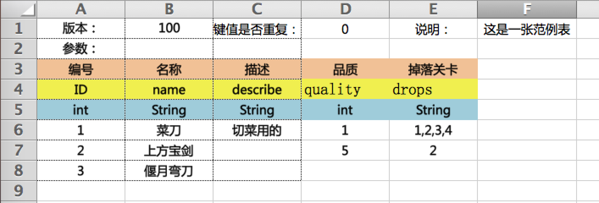

# 配置文件参数详解

```shell
# 执行导表
python main.py --export my_config.py
```

导表的时候，需要指定一个Python格式的配置文件，描述了导表过程中需要的一些参数。目前，导表工具支持2种表格配置方式：
1. Direct。在Excel表头中指定导出的字段名、字段类型，导表工具使用这些信息，生成数据字典。这种方式比较方便，但是不够灵活，不能对数据进行深度处理，比如字段合并、生成新字段。
2. Config。为每一种类型的Excel文件指定一个转换脚本，提供表头和数据的转换信息。这种方式支持数据深度处理，数据校验等。缺点是，要写为每一种类型的Excel都写一个脚本。

下面逐一介绍如何配置。

# 通用配置
注意，配置参数要区分大小写。路径相关的参数，都是相对路径，相对于当前的配置文件。

## post_init_method
额外的初始化方法，执行一些自定义的初始化工作。比如修改配置，自定义代码注入等。
```python
def post_init_method():
    pass
```

## EXPORTER_CLASS
执行导出逻辑的python类。目前可用的类有`DirectExporter`，`ConfigExporter`，`MixExporter`。这些类，位于`exporters`目录下。你也可以使用自定义的导出类，将类赋值给`exporters`模块，然后将`EXPORTER_CLASS`指定为你的类名字。

```python
EXPORTER_CLASS = "DirectExporter"
```

## INPUT_PATH
要转换的Excel文件所在目录。导表的时候，该目录及其子目录下的所有Excel文件都会被处理。因此，非数据相关的表，不要放到这里。

```python
INPUT_PATH = "excels"
```

## TEMP_PATH
中间文件路径。存放导表过程中生成的中间文件。如果导表的时候，指定了`--fast-mode`，这些中间文件会被复用。

```python
TEMP_PATH = "export/temp"
```

## DEFAULT_JAVA_PACKAGE
默认Java包名。只有生成Java相关代码的时候才有用。

```python
DEFAULT_JAVA_PACKAGE = "com.mygame.default.package"
```

## CODE_GENERATORS
代码生成器参数。`CODE_GENERATORS`是一个数组，可以指定多个生成器的参数。目前仅支持Java代码生成器。

```python
CODE_GENERATORS = [
    {
        "class" : "JavaCodeGen",
        "name_format" : "Dict%s",
        "file_path" : "export/java/excel",
        "imports" : ["com.mygame.test"],
        "interface" : "IInterface",
        "base" : "BaseClass",
    }
]
```

生成器参数 | 描述
---------|---------
class  | 生成器的类名
file_path | 输出文件的路径。最终的文件名为`file_path` + Excel文件名 + ".java"
package | 为生成的Java类指定包名。如果不指定，则使用`DEFAULT_JAVA_PACKAGE`
imports | 为生成的Java类指定要导入的包。改参数是数组格式，支持导入多个包。
base  | 为生成的Java类指定基类。
interface | 为生成的Java类指定接口类。

## DATA_WRITERS
为输出数据表指定参数。`DATA_WRITERS`是一个数组，支持多个writer。writer类位于writers目录下，目前支持输出的数据表格式有Python、Lua、Json和Java专用的Json格式。可以自定义writer类，将自定义类赋值给`writers`模块。

```python
DATA_WRITERS = [
    {
        "stage" : 1,
        "class" : "LuaWriter",
        "file_path": "export/lua",
        "file_posfix" : ".lua"
    }
]
```

writer参数 | 描述
----------|--------
stage   | 导表阶段。目前分两个阶段：Begin(1), Final(2)。Begin阶段的数据没有进行后处理。
class   | writer类。位于writers目录下。
file_path | 输出数据表的路径
file_posfix | 输出数据表的后缀

## POSTPROCESSORS
后处理器。在导表最后阶段调用，能够访问到exporter的所有数据。常用于生成文件列表。`POSTPROCESSORS`是一个数组，支持配置多个processor。processor类位于`postprocess`目录下，目前支持生成Java文件映射表。

```python
POSTPROCESSORS = [
    {
        "class" : "JavaFileEnumProcessor",
        "file_path" : "export/java/excel/DictEnum.java"
    }
]
```


## DEPENDENCIES
Python插件安装包路径。目前导表工具依赖`openpyxl`。你可以指定插件的安装包路径，导表工具会自动检测插件是否存在，如果不存在会进行安装。方便为非技术人员使用。

```python
DEPENDENCIES = {
    "openpyxl" : "openpyxl-2.4.4.zip"
}
```

## ARGUMENT_CONVERTER
Excel表头参数解析，通常是针对Excel表的第一行。你可以在Excel中指定额外的信息，导表工具会分析出来，并存贮在中间模块中，其他的处理器可以访问到。

```python
ARGUMENT_CONVERTER = {
    "版本：" : ["version", "int"],
    "键值是否重复：" : ["multiKey", "bool"],
    "说明：" : ["describe", "string"],
}
```

## SHEET_ROW_INDEX
Excel表格数据所在行。索引从0开始，不填或填-1表示该行不存在。

```python
SHEET_ROW_INDEX = {
    # Excel表头参数。通常是版本信息和说明等，该行必须存在。
    "argument" : 0,
    # 表头。该行必须存在。
    "header" : 1,
    # 数据首行索引。该行必须存在。
    "data" : 2,
    # 字段。Direct模式下，该行必须存在
    "field" : -1,
    # 类型行。Direct模式下，该行必须存在
    "type" : -1,
}
```

# Direct模式
Direct模式下，数据描述信息全部由Excel表提供。表格的行"argument"，"header"，"field"，"type"，"data"，都会使用到。



# Config模式
Config模式下，数据描述信息有转换器脚本提供。因此，表头结构简单，但是需要提供额外的转换器脚本文件。


## CONVERTER_PATH
转换器所在的父级路径。

```python
CONVERTER_PATH = "converters"
```

## CONVERTER_ALIAS
转换器目录名，位于`CONVERTER_PATH`下。该目录存在的目的，只是为了防止命名冲突。

```python
CONVERTER_ALIAS = "converter"
```

## CONVENTION_TABLE
Excel与转换器对应关系表。每个数组元素也是一个数组，描述了Excel与转换器的对应关系。

```python
CONVENTION_TABLE = (
    ("example.xlsx", "example", ),
    (r"stage/normal/\d+/enemy.xlsx", "stage.enemy"), #-> stage/normal/\d+/enemy
    (r"(stage/normal/\d+/)enemy.xlsx", "stage.enemy", r"\1d_enemy", 0), #-> stage/normal/\d+/d_enemy
)
```

数组索引 | 描述
--------|------
 0      | 输入的Excel文件路径，路径相对于`INPUT_PATH`。**支持正则表达式**。
 1      | 转换器模块路径，路径相对于`CONVERTER_PATH/CONVERTER_ALIAS`。注意路径用符号'.'连接，而不是'/'。
 2      | 输出文件别名。支持**正则表达式替换**输入路径的名称。
 3      | excel文件的工作表索引。

## MERGE_TABLE
分表合并关系描述表。用来将几个分表合成一张总表。每个数组元素也是一个数组，0号位是合并后的文件名，1号位往后是要合并的文件名，支持正则表达式。注意，文件都不含后缀。
```python
MERGE_TABLE = (
    ("entity/entity", "entity/entity_subsheet", r"entity/entity_part\d+", ),
)
```
